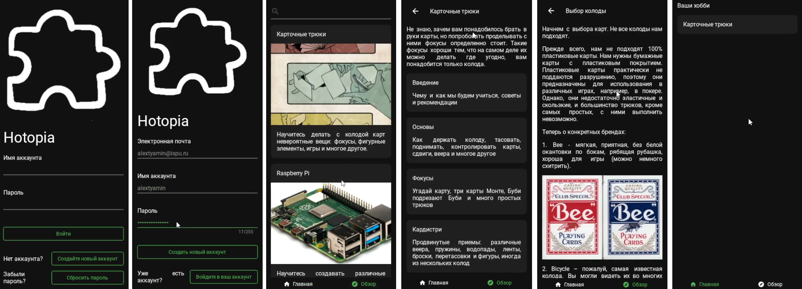

# HOTOPIA
"Hobby utopia", educational project, hobby search application.

This project contains two main parts:
- Client - a mobile application, build with Kivy and KivyMD
- Server - FastAPI, SQLAlchemy, Redis

The common part stores validation schemas and URLs.

Python version - 3.12.

## Getting started
So, clone this repo:
```
git clone https://github.com/gunslaveunit/hotopia
```
Add path/to/a/project/hotopia to system variables, so Python can look for common, server and client.

Create virtual environment:
```
cd hotopia/
python -m venv venv
source venv/bin/activate # or without "source" for Windows
```

Install requirements for both client and server:
```
pip install -r server/requirements.txt
pip install -r client/requirements.txt
```

Configure your .env file. Default is:
```
HOST=127.0.0.1
PORT=8000
DEBUG=True
RELOAD=True
DB_URL=sqlite+aiosqlite:///hotopia.sqlite3
```

Run both parts:
```
python server/src/run.py
python client/src/run.py
```
